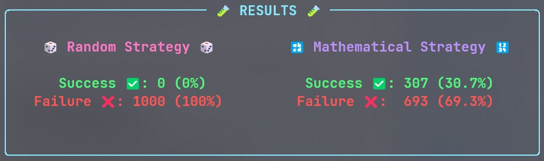

# O Problema dos 100 prisioneiros 

O problema dos 100 prisioneiros é um problema matemático de probabilidade e combinatória, sua definição original pode ser encontrada em [Gál e Miltersen (2003)](https://doi.org/10.1007/3-540-45061-0_28).

### Sumário

- [O Problema dos 100 prisioneiros](#o-problema-dos-100-prisioneiros)
    - [Sumário](#sumário)
  - [Definição](#definição)
  - [Estratégias de solução](#estratégias-de-solução)
    - [Estratégia randômica](#estratégia-randômica)
    - [Estratégia matemática](#estratégia-matemática)
  - [Objetivo](#objetivo)
  - [Algoritmo](#algoritmo)
  - [Resultados](#resultados)
  - [Referências](#referências)

## Definição

A definição aqui utilizada para o problema dos 100 prisioneiros foi extraída de [Flajolet e Sedgewick (2009, p. 124)](http://algo.inria.fr/flajolet/Publications/book.pdf):

> "A hundred prisoners, each uniquely identified by a number between 1 and 100, have been sentenced to death. The director of the prison gives them a last chance. He has a cabinet with 100 drawers (numbered 1 to 100). In each, he’ll place at random a card with a prisoner’s number (all numbers different). Prisoners will be allowed to enter the room one after the other and open, then close again, 50 drawers of their own choosing, but will not in any way be allowed to communicate with one another afterwards. The goal of each prisoner is to locate the drawer that contains his own number. If all prisoners succeed, then they will all be spared; if at least one fails, they will all be executed."

## Estratégias de solução

Diante do problema definido há duas estratégias de solução que serão utilizadas

### Estratégia randômica

Nesta estratégia os prisioneiros escolherão as gavetas de forma randômica. Diante disto a probabilidade $P_i$ de um prisioneiro $i$ encontrar seu número é:

$$P_i(\text{sucesso}) = \frac{50\,\, \text{tentativas}}{100\,\, \text{gavetas}} =\frac{1}{2} = 0.5$$

Para 100 prisioneiros, como os eventos são independentes, a probabilidade de todos encontrarem seus números é dada pelo seguinte produtório:

$$\prod_{i=1}^{100}p_i=\frac{1}{2^{100}}\approx7.8886 \cdot10^{-31} $$

### Estratégia matemática

Nesta estratégia os prisioneiros seguirão o seguinte algoritmo:

1. Abra a gaveta com o seu número correspondente.
2. Se a gaveta aberta conter o cartão com o seu número FINALIZE. Caso não, abra a gaveta com este número.
3. Caso o número de gavetas abertas seja menor ou igual a 50 repita o passo 2. Caso não, FINALIZE.

Esta estratégia se baseia no princípio de que esta configuração de gavetas e cartões geram ciclos, ou seja, cada gaveta aponta para outra gaveta de forma que se possa formar um ciclo de tamanho $L$. Na pior das hipóteses este ciclo terá 100 gavetas e na melhor 1. Desta forma, se o tamanho do maior ciclo $\max{(L)}$ na configuração de gavetas e cartões for menor ou igual a 50, garantidamente todos os prisioneiros encontrarão os cartões com seus números. Então a probabilidade que rege o sucesso destes prisioneiros é dada pela probabilidade do tamanho do maior $\max{(L)}$ ciclo ser menor ou igual a 50. Esta probabilidade é dada por:

$$P(\max{(L)}\leq50)=1-\sum_{j=51}^{100}\frac{1}{j}\approx0.3118$$

Uma prova para este resultado pode ser vista no [vídeo de Derek Muller, Petr Lebedev e Emily  Zhang no canal Veritasium](https://www.youtube.com/watch?v=iSNsgj1OCLA).

## Objetivo

Desenvolver um algoritmo de simulação do Problema dos 100 Prisioneiros, de forma que se possa confirmar a eficácia da estratégia matemática em relação à estratégia randômica.

## Algoritmo

O algoritmo foi construído inteiramente em Python, na versão 3.10.2 com o uso do módulo ` random`. Você precisará do Python instalado para executar este algoritmo.

Para executar o algoritmo clone este repositório usando:

`git clone`

Crie um arquivo `.py` na pasta do projeto e execute o seguinte trecho de código:

```python
from main import Problem

problem = Problem()  

result_random = problem.start() # estratégia randômica

result_math = problem.start(math_strategy=True) # estratégia matemática
```

Este código executará o problema uma única vez, `result_random` e `result_math` são variáveis boolenas, serão `True` caso todos os prisioneiros encontrem seus cartões e `False` caso contrário.

## Resultados

Para verificar a eficácia da estratégia matemática o problema foi executada 1000 vezes, onde pôde-se comparar a performance dos métodos:



## Referências

- GÁL, A.; MILTERSEN, P. B. The Cell Probe Complexity of Succinct Data Structures. In: BAETEN, J. C. M. et al. (Eds.). **Automata, Languages and Programming.** Berlin, Heidelberg: Springer Berlin Heidelberg, 2003. v. 2719p. 332–344. 
- FLAJOLET, P.; SEDGEWICK, R. **Analytic combinatorics.** Cambridge ; New York: Cambridge University Press, 2009. 
- MULLER, D.; LEBEDEV, P.; ZHANG, E. **The Riddle That Seems Impossible Even If You Know The Answer.**, 2022 Disponível em: <https://www.youtube.com/watch?v=iSNsgj1OCLA>. Acesso em: 24 dez. 2022. 
